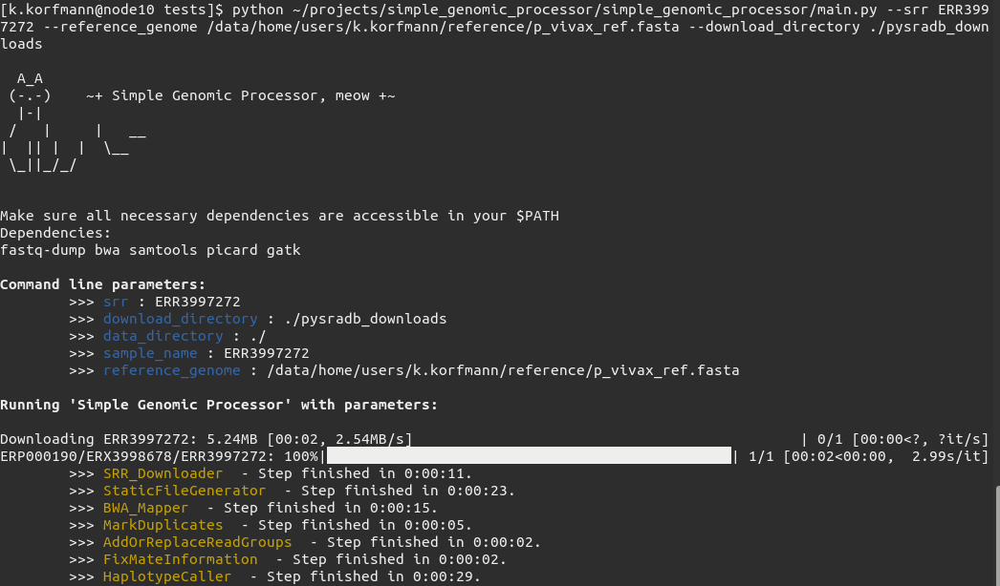

# Simple Genomic Processor (SRR->gVCF): 
Some python classes to get genomic VCF files through a series of classical NGS processing approaches. Files are downloaded with pysradb, unpacked with fastq-dump, mapped with bwa and further processed with picard. Single nucleotide variants are called with gatks haplotype caller. Samtools is used for various intermediate steps.

## Usage case:
Ideally a good quality sequence is searched through publications or directly through NCBI SRA. Next, reference genome is searched for. Afterwards, SRR identifier and reference genome are then used as input for the simple genomic processor.

## Dependencies
- fastq-dump          
- samtools   
- bwa    
- picard   
- gatk   

## Installation:

git clone https://github.com/kevinkorfmann/sgp.git    
cd sgp     
pip install .     

## Usage:

```bash
./main.py --srr ERR3997272 --reference_genome ./reference/p_vivax_ref.fasta --download_directory ./pysradb_downloads
```

## Picture:


