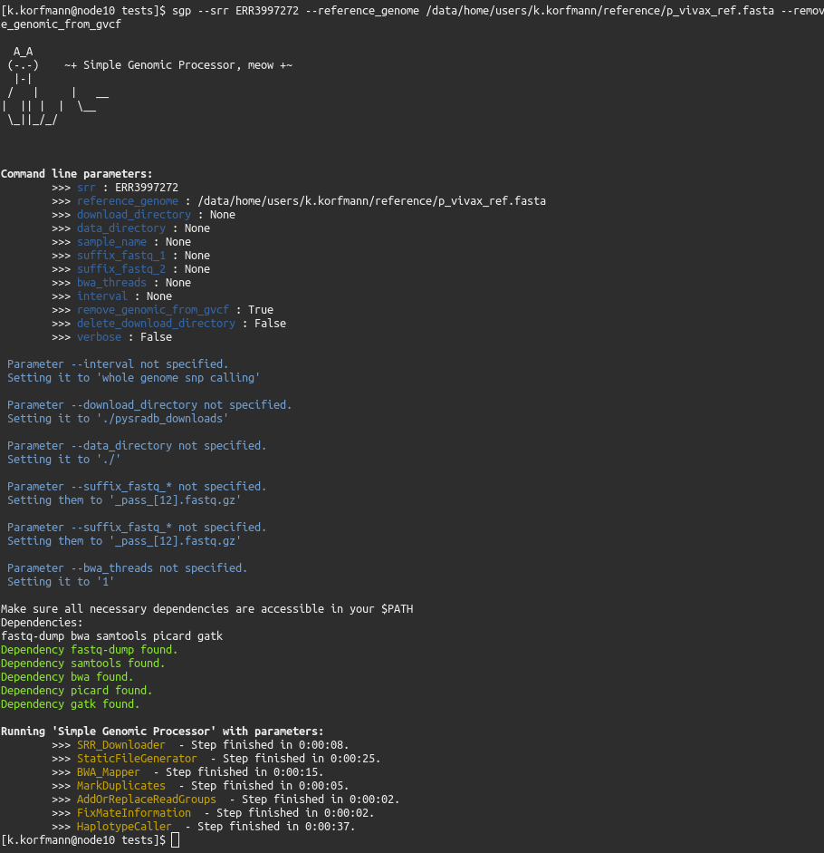

# Simple Genomic Processor: From SRR identifier to genomic VCF file

## Installation:

git clone https://github.com/kevinkorfmann/sgp.git    
cd sgp     
pip install .     

## Usage:

```bash
./main.py --srr ERR3997272 --reference_genome ./reference/p_vivax_ref.fasta --download_directory ./pysradb_downloads
```

## Picture:


